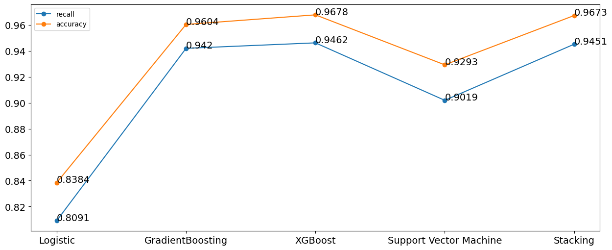

# Dự đoán bệnh đột quỵ dựa trên các chỉ số lâm sàn
## Tổng quan:
Dự án thực hiện trực quan hóa dữ liệu và sử dụng kiểm định giả thuyết thống kê để so sánh với các kết quả nghiên cứu lâm sàn có sẵn nhầm kiểm định độ tin cậy của bộ dự liệu. Xây dựng mô hình dự đoán bệnh đột quỵ sử dụng các mô hình học máy.
## Kết quả của mô hình dự đoán:

  

## Các thư viện sử dụng:
* pandas
* numpy
* seaborn
* matplotlib
* sklearn
* imblearn

